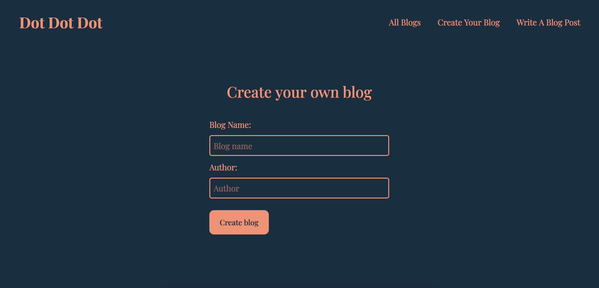

# Dot dot dot - Blog CMS
A minimalistic blog CMS built with TypeScript and using local storage to save blog posts.

### Screenshot

### Links

- Live Site URL: [Add live site URL here](https://your-live-site-url.com)

### Built with

- Semantic HTML5 markup
- CSS
- SASS
- Flexbox
- TypeScript
- Bootstrap
- Mobile-first workflow

### What I learned

## Author

- GitHub - [malin-nilsson](https://github.com/malin-nilsson)

## Acknowledgments

