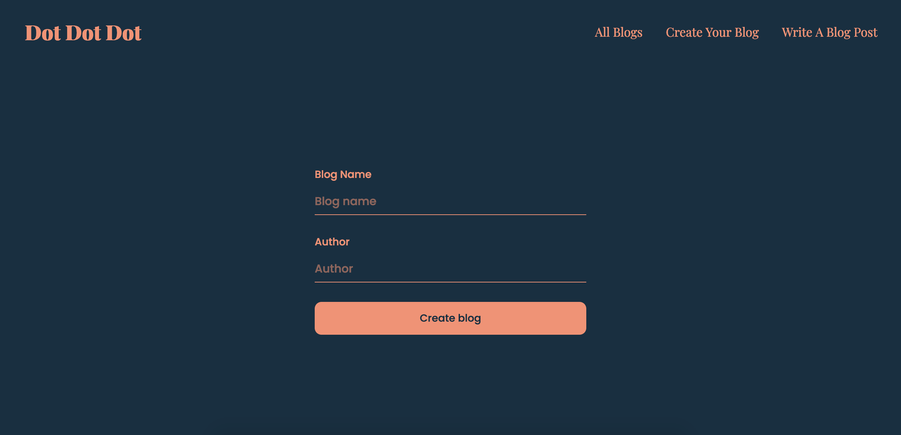

# Dot dot dot - Blog CMS
A minimalist blog CMS built with TypeScript with features like publishing a blog, viewing other blogs, as well as creating and deleting blog posts. 

During this project I had the opportunity to develop my TypeScript skills and practice unit testing with Cypress. I also got to see how far I could push the vanilla tools since I built this project without a framework or database, only utilizing local storage.

## Installation
1. Clone the repo\
`git clone https://github.com/malin-nilsson/blogcms.git`

2. Install npm packages\
`npm install`

3. Run Parcel\
`npm run build`

Visit localhost:1234 to view the project

## Tools
- HTML & SASS
- TypeScript
- Bootstrap
- NPM
- Cypress

## Author
- GitHub - [malin-nilsson](https://github.com/malin-nilsson)
